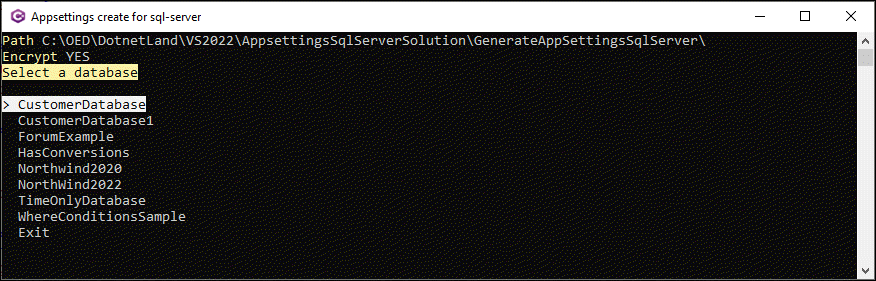
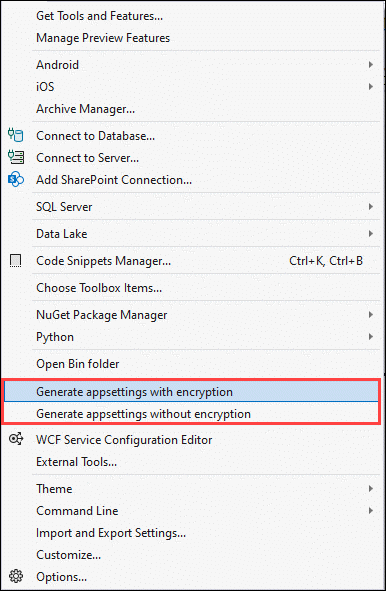
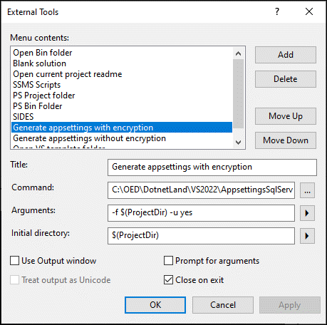

# Create appsettings.json with SQL-Server tool in Visual Studio using external tools


A tool to create a `appsettings.json` file in the current project setup with connection strings for SQL-Server for any project not using dependency injection.

By adding the tool to external tools and using the following NuGet package [Configuration library](https://www.nuget.org/packages/ConfigurationLibrary/) the project can easily create a connection string for either Entity Framework Core or SqlClient data provider.

## With EF Core

- Add the package [Configuration library](https://www.nuget.org/packages/ConfigurationLibrary/) to a project
- Run the tool
- Add the following to the DbContext

```csharp
protected override void OnConfiguring(DbContextOptionsBuilder optionsBuilder)
{
    if (!optionsBuilder.IsConfigured)
    {
        optionsBuilder.UseSqlServer(ConfigurationHelper.ConnectionString());
    }
}
```

## EF Core 7

Encrypt defaults to true for SQL Server connections (see [this page](https://learn.microsoft.com/en-us/ef/core/what-is-new/ef-core-7.0/breaking-changes#encrypt-true))

Using `-f $(ProjectDir) -u no` will ensure there are no issues moving forward.


## With SqlClient

- Add the package [Configuration library](https://www.nuget.org/packages/ConfigurationLibrary/) to a project
- Run the tool
- Create a - Create a Add the following to the DbContext as shown below

```csharp
using var cn = new SqlConnection(ConfigurationHelper.ConnectionString());
```


## Running as an external tool




# Added to external tools



## Tool 1

Configure to add encryption to connection string

| Property        | Value      | 
|:------------- |:-------------|
| Title | Generate appsettings with encryption | 
| Command | Location of the executable | 
| Arguments | -f $(ProjectDir) -u yes |
| Initial directory | $(ProjectDir) |

## Tool 2

Configure without encryption for connection string

| Property        | Value      | 
|:------------- |:-------------|
| Title | Generate appsettings without encryption | 
| Command | Location of the executable | 
| Arguments | -f $(ProjectDir) -u no | 
| Initial directory | $(ProjectDir) |  

### Specify localDb or SqlExpress

`-l no` uses SqlExpress while `-l yes` will use localDb for either of the above setups.



# ASP.NET Core

Currently not configured as there are two many variables in the structure of the appsettings.json file. What you can do is run the tool with an existing appsettings.json file and a unique appsettings file is created so the settings can be copied to your appsettings file.

Will be thinking about a work around for this.

# Summary

External Tools in Visual Studio offer the user to add tools such as this one along with other tools and to open common folders like the current bin folder of a selected project. Think about what you can do with external tools.